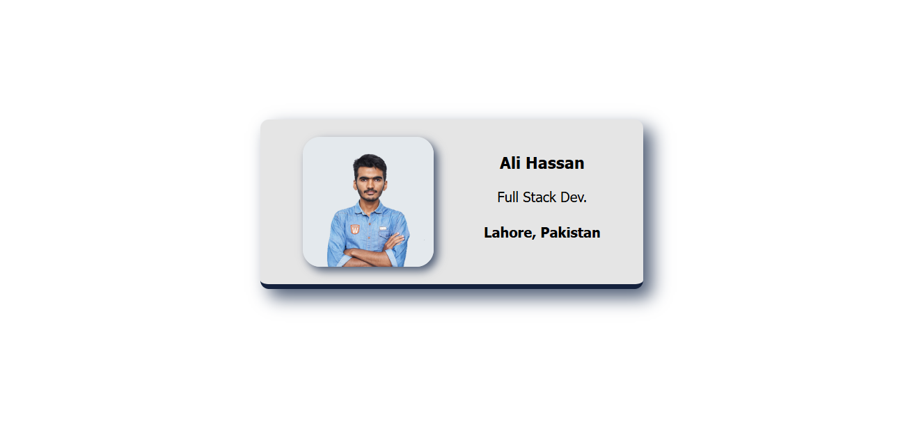

# 💼 Interactive Business Card

A modern, responsive digital business card built with HTML, CSS, and Vite. This project showcases a professional profile card with interactive hover effects and smooth animations.



## ✨ Features

- **Responsive Design**: Clean, modern layout that works on all devices
- **Interactive Elements**: Hover effects with smooth scaling and shadow transitions
- **Professional Styling**: Elegant color scheme with rounded corners and shadows
- **Smooth Animations**: CSS transitions for enhanced user experience
- **Profile Information**: Displays name, title, and location
- **Avatar Support**: Professional profile picture integration

## 🚀 Live Demo

**🌐 Live Project**: [View Live Business Card](https://business-card-ali.netlify.app/)

The business card displays:

- **Name**: Ali Hassan
- **Title**: Full Stack Developer
- **Location**: Lahore, Pakistan

## 🛠️ Technologies Used

- **HTML5**: Semantic markup structure
- **CSS3**: Modern styling with flexbox, shadows, and animations
- **Vite**: Fast build tool and development server
- **Responsive Design**: Mobile-first approach

## 📁 Project Structure

```
business-card/
├── images/
│   ├── Ali.png          # Profile picture
│   ├── Image.png        # Project preview image
│   └── per.png          # Additional image
├── index.html           # Main HTML file
├── styles.css           # CSS styling and animations
├── package.json         # Project dependencies
├── vite.config.js       # Vite configuration
└── README.md            # Project documentation
```

## 🎨 Design Features

- **Color Palette**: Professional grey tones with blue accents
- **Typography**: Clean Tahoma font for readability
- **Layout**: Flexbox-based responsive design
- **Shadows**: Subtle drop shadows for depth
- **Hover Effects**: Interactive scaling and shadow changes
- **Border Radius**: Rounded corners for modern aesthetics

## 🚀 Getting Started

### Prerequisites

- Node.js (version 14 or higher)
- npm or yarn package manager

### Installation

1. **Clone the repository**

   ```bash
   git clone <your-repo-url>
   cd business-card
   ```

2. **Install dependencies**

   ```bash
   npm install
   ```

3. **Start development server**

   ```bash
   npm run dev
   ```

4. **Open in browser**
   Navigate to `http://localhost:5173` to view your business card

### Build for Production

```bash
npm run build
```

### Preview Production Build

```bash
npm run preview
```

## 🎯 Customization

### Personal Information

Edit `index.html` to update:

- Profile picture (`images/Ali.png`)
- Name, title, and location

### Styling

Modify `styles.css` to customize:

- Colors and typography
- Layout and spacing
- Animations and transitions
- Hover effects

### Color Palette

The current design uses a professional color scheme:

- Primary: `#E5E5E5` (Light grey)
- Accent: `#14213D` (Dark blue)
- Shadow: `#4f5d75` (Medium blue-grey)

## 🌟 Advanced Features

- **Hover Animations**: Smooth scale and shadow transitions
- **CSS Transitions**: 0.3s ease-in-out animations
- **Box Shadows**: Multi-layered shadow effects
- **Responsive Layout**: Flexbox-based positioning
- **Modern CSS**: Border-radius, transitions, and transforms

## 📱 Responsive Design

The business card is designed to work seamlessly across all device sizes:

- **Desktop**: Full-size display with hover effects
- **Tablet**: Optimized layout for medium screens
- **Mobile**: Responsive design for small screens

## 🔧 Development

This project uses Vite for fast development and building:

- **Hot Module Replacement**: Instant updates during development
- **Fast Build**: Optimized production builds
- **Modern Tooling**: Latest web development standards

## 📄 License

This project is open source and available under the [MIT License](LICENSE).

## 🤝 Contributing

Contributions are welcome! Please feel free to submit a Pull Request.

## 📞 Contact

- **Developer**: Ali Hassan
- **Email**: m.alihassan002@gmail.com
- **Role**: Full Stack Laravel Developer 
- **LinkedIn**: [Full Stack Laravel Developer ](https://www.linkedin.com/in/ali-hassan-9ba69220b/)

---

_Built with ❤️ using modern web technologies_
